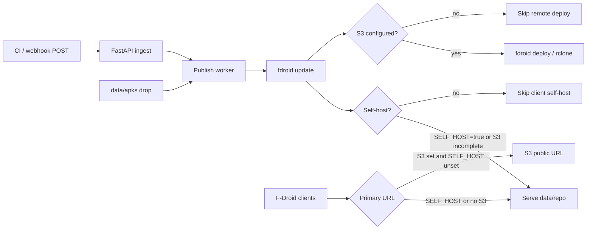

# Docker dual-mode F-Droid server

## Current state

Today the repo is a **batch job**: drop APKs in [`apks/`](apks/), run [`scripts/publish.sh`](scripts/publish.sh) (or `docker compose run`), which cleans → `fdroid update` → `fdroid deploy` to S3. There is no HTTP server, no webhook, and publish **fails** if S3 is unset ([`scripts/publish.sh`](scripts/publish.sh) lines 17–20).

A pending multi-tenant FastAPI + Vite plan exists under [`.cursor/plans/vite_admin_frontend_55bea417.plan.md`](.cursor/plans/vite_admin_frontend_55bea417.plan.md). This phase **does not** build that GUI or multi-org model; it adds the deploy/ingest foundation the GUI will sit on later.

## Target behavior



**Modes (env-driven, single tenant):**

- **Self-host** — when `SELF_HOST=true` **or** S3 vars are incomplete:
  - generate + serve `data/repo/`
  - client-facing `REPO_URL` is the container URL (e.g. `https://host:8000/fdroid/repo`)
- **S3 primary** — when all `S3_*` are set **and** `SELF_HOST` is not true:
  - ingest → build → `fdroid deploy`
  - `REPO_URL` is the public bucket URL
  - local `data/repo/` is still written (pipeline output / debug), but not the client primary

**Combined:** `SELF_HOST=true` with S3 fully configured still self-hosts as primary (`REPO_URL` local) and **also** runs `fdroid deploy` as a mirror. Incomplete S3 alone is enough to enable self-host without setting the flag.

Default: leave `SELF_HOST` unset and leave S3 blank → self-host. Set S3 for remote primary. Set `SELF_HOST=true` to force local serving even when S3 is present.

## One volume layout

Compose mounts **exactly one** volume: `./data:/data` (or a named volume `fdroid-data:/data`). Everything mutable lives under it. Image ships read-only code (`backend/`, `scripts/`, default `assets/icon.png`).

```
data/
├── apks/              # ingested / dropped APKs
├── metadata/          # fdroid per-app YAML
├── repo/              # generated index + APK copies (nginx root)
├── tmp/ cache/        # fdroid scratch
├── keystore.p12       # repo signing key (created on first run if missing)
├── config.yml         # generated
├── rclone.conf        # generated when S3 set
├── assets/            # optional override of repo icon
└── status.json        # last publish job status
```

Scripts and the API use `DATA_DIR=/data` (default). Local bare-metal can set `DATA_DIR=.` to keep today’s flat layout, or migrate to `./data` for parity with Docker.

No separate binds for `apks/`, `metadata/`, `repo/`, or `keystore.p12`.

## Architecture (this phase)

Single Docker Compose stack, long-running (prefer **one container** with API + nginx sidecar process, or API that also static-serves `data/repo` under `/fdroid/repo/` to avoid a second service):

1. **API** — small FastAPI app wrapping existing script logic:
   - `POST /hooks/apk` — bearer/token auth; multipart APK; saves to `data/apks/`; enqueues publish
   - `POST /hooks/publish` — token auth; trigger rebuild/deploy without new APK
   - `GET /health` — liveness
   - `GET /api/status` — last publish status + mode (`self_host` | `s3`)
   - Static mount of `data/repo/` at `/fdroid/repo/` when self-host is active (`SELF_HOST=true` or S3 incomplete)
2. **Reuse** [`scripts/init.sh`](scripts/init.sh), [`scripts/build.sh`](scripts/build.sh), deploy via `fdroid deploy` when S3 is configured — all `cwd` / paths under `DATA_DIR`

Keep bash scripts as the fdroid runner (subprocess from FastAPI). Later GUI can call the same endpoints.

## Concrete changes

### 1. Make publish dual-mode + data-dir aware

Update [`scripts/publish.sh`](scripts/publish.sh) / [`build.sh`](scripts/build.sh) / [`init.sh`](scripts/init.sh) / [`clean.sh`](scripts/clean.sh):

- Honor `DATA_DIR` (default `.` for bare metal, `/data` in Docker).
- After build, if S3 incomplete: **succeed** with “self-host only” (do not exit 1).
- If S3 configured: run `fdroid deploy` (including when `SELF_HOST=true` — mirror).
- Resolve mode for status/logs: `self_host` if `SELF_HOST=true` or S3 incomplete; else `s3`.
- Webhook path: incremental `build` + optional deploy (no full `clean` every time); keep destructive `publish.sh` for manual full resets.

### 2. Fix Docker for long-running deploy (one volume)

- Change [`Dockerfile`](Dockerfile): install Python + FastAPI/uvicorn; copy `backend/` + `scripts/` + default `assets/`; CMD runs API; `DATA_DIR=/data`.
- Update [`docker-compose.yml`](docker-compose.yml) to a single mount only:

```yaml
services:
  fdroid:
    build: .
    env_file: .env
    environment:
      DATA_DIR: /data
    ports:
      - "8000:8000"
    volumes:
      - ./data:/data
```

- Teach [`scripts/init.sh`](scripts/init.sh) to use process env when `.env` is missing (compose `env_file` injects vars but does not create a file).
- Optional profile: `docker compose run --rm fdroid scripts/publish.sh` for one-shot full publish against the same volume.

### 3. Webhook ingest + publish worker

New [`backend/`](backend/) (minimal):

- Auth via `WEBHOOK_TOKEN` env
- Serialize publishes (one job at a time); write `data/status.json`
- Paths always under `DATA_DIR`

### 4. Config / docs

- Extend [`.env.example`](.env.example): `SELF_HOST`, `WEBHOOK_TOKEN`, `DATA_DIR`; document mode selection (`SELF_HOST=true` **or** leave S3 blank = self-host; S3 set + `SELF_HOST` unset = S3 primary).
- Update [`README.md`](README.md): `docker compose up`, one-volume layout, webhook examples, self-host vs S3 primary.

### 5. Explicitly out of scope (future GUI)

- No Vite admin UI, multi-org SQLite model, or CLI `fdroid-mgr` in this phase.
- Endpoints stay stable enough that the existing Vite plan can later mount a SPA and call `/hooks/*` / expanded `/api/*`.

## Key files

- [`scripts/publish.sh`](scripts/publish.sh) / [`build.sh`](scripts/build.sh) / [`init.sh`](scripts/init.sh) — `DATA_DIR` + dual-mode deploy
- [`Dockerfile`](Dockerfile) / [`docker-compose.yml`](docker-compose.yml) — one volume `./data:/data`
- `backend/main.py` (new) — webhooks + status + static repo
- [`.env.example`](.env.example) / [`README.md`](README.md) — mode + volume docs

## Default decisions (locked for this plan)

- **One volume** — only `./data:/data` (or a named equivalent); no multi-bind compose.
- **Single-tenant** for now; multi-tenant deferred with the GUI.
- **Self-host** when `SELF_HOST=true` **or** S3 incomplete; `REPO_URL` = container `/fdroid/repo` URL.
- **S3 primary** when S3 is fully configured and `SELF_HOST` is not true; local repo still built; `SELF_HOST=true` + S3 ⇒ local primary + S3 mirror.
- **GUI deferred**; only API + static repo serving now.
- Prefer **one container** serving both API and repo static files to match the one-volume simplicity.
