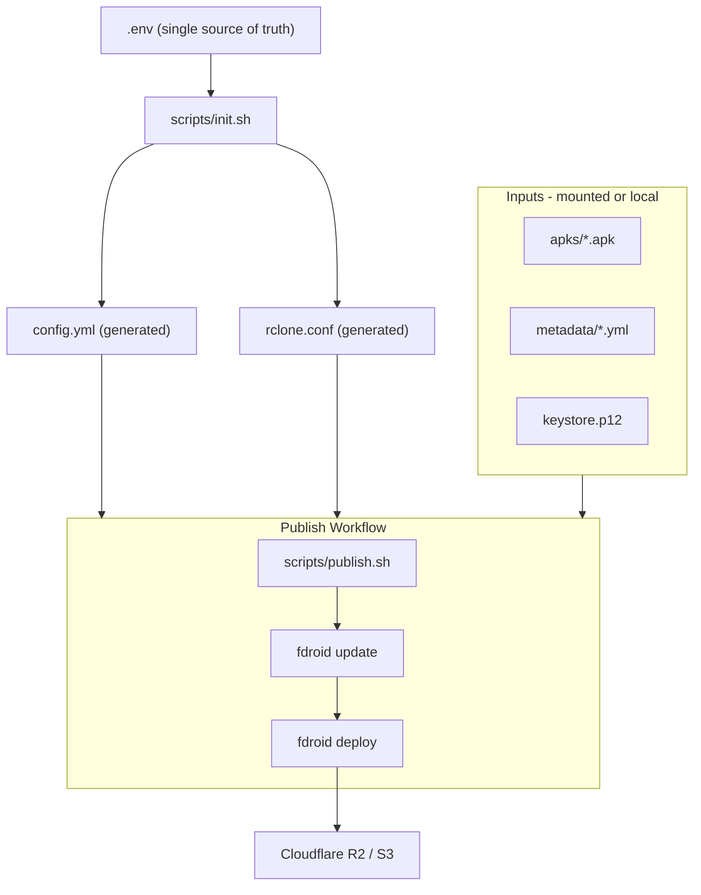

# Standardize F-Droid Repo for Portable Deployment

## Current Problems

- Secrets hardcoded in `config.yml` (keystorepass/keypass in plaintext) and `sign-and-copy.sh`
- `rclone.conf` has inline R2 credentials
- `config.yml` is 467 lines of mostly default comments -- actual config is ~15 lines
- No single source of truth for configuration
- Manual, undocumented workflow
- `start.sh` is a dead script using a different keystore
- Junk metadata files (`fbee0.app.yml`, macOS `._entry` artifact)

## Architecture



## Changes

### 1. Create `.env.example` -- single config source

All config for both `config.yml` and `rclone.conf` in one file:

```bash
# F-Droid Repo
REPO_NAME="DigitalMarket App Store"
REPO_DESCRIPTION="Apps distributed by The Digital Market App Store."
REPO_URL="https://apps.digitalappstore.xyz/fdroid/repo"
REPO_WEB_BASE_URL="https://apps.digitalappstore.xyz/packages/"

# Signing
KEYSTORE_FILE="keystore.p12"
REPO_KEYALIAS="G-M1-MacBookPro-20.local"
KEYSTORE_PASS=""
KEY_PASS=""
KEYDNAME="CN=G-M1-MacBookPro-20.local, OU=F-Droid"

# S3 / rclone
S3_REMOTE_NAME="fdroid-repo"
S3_PROVIDER="Cloudflare"
S3_BUCKET="digitalmarket-repo"
S3_ACCESS_KEY_ID=""
S3_SECRET_ACCESS_KEY=""
S3_REGION="auto"
S3_ENDPOINT=""
```

### 2. Create `scripts/init.sh` -- generate configs from `.env`

Reads `.env`, generates a clean `config.yml` and `rclone.conf` using heredocs. No `envsubst` dependency -- pure bash with variable expansion. This replaces the current 467-line config.yml with a generated ~30-line one containing only active settings.

### 3. Create `scripts/publish.sh` -- full pipeline

Single command that:
1. Sources `.env`
2. Runs `init.sh` if configs don't exist
3. Copies APKs from `apks/` to `repo/`
4. Runs `fdroid update --create-metadata --pretty`
5. Runs `fdroid deploy`

### 4. Refactor `sign-and-copy.sh` into `scripts/verify.sh`

Remove hardcoded credentials. Read `KEYSTORE_PASS` and other vars from `.env`. Keep verification logic, remove dead signing code that was already commented out.

### 5. Create `Dockerfile`

Lightweight image based on `debian:bookworm-slim`:
- Install `fdroidserver`, `rclone`, Android SDK build-tools (for `apksigner`)
- Copy `scripts/` into image
- Entrypoint runs `init.sh` then accepts commands (`update`, `deploy`, `publish`)

### 6. Create `docker-compose.yml`

```yaml
services:
  fdroid:
    build: .
    env_file: .env
    volumes:
      - ./apks:/srv/fdroid/apks
      - ./metadata:/srv/fdroid/metadata
      - ./keystore.p12:/srv/fdroid/keystore.p12:ro
      - ./repo:/srv/fdroid/repo
```

### 7. Clean up

- **Delete** `start.sh` (dead code, references wrong keystore)
- **Delete** `metadata/fbee0.app.yml` (legacy package ID)
- **Delete** macOS artifact metadata file
- **Update** `.gitignore` to include `.env`, `config.yml` (now generated), and existing entries
- **Rewrite** `README.md` with setup instructions for both bare-metal and Docker usage

### 8. Resulting directory structure

```
.
├── .env.example          # Template -- copy to .env and fill in
├── .env                  # Actual config (gitignored)
├── .gitignore
├── README.md
├── Dockerfile
├── docker-compose.yml
├── scripts/
│   ├── init.sh           # Generate config.yml + rclone.conf from .env
│   ├── publish.sh        # Full pipeline: copy, update, deploy
│   └── verify.sh         # APK signature verification
├── apks/                 # Drop APKs here (input)
├── metadata/             # App metadata YAML files
├── keystore.p12          # Signing keystore (gitignored)
├── config.yml            # Generated (gitignored)
├── rclone.conf           # Generated (gitignored)
├── repo/                 # Generated F-Droid repo output
└── tmp/                  # F-Droid cache
```

## What stays out of scope (for now)

- Sub-org / multi-repo support (user said "later")
- CI/CD automation (GitHub Actions etc.)
- APK signing within the pipeline (currently pre-signed APKs are expected)
- Build server integration
