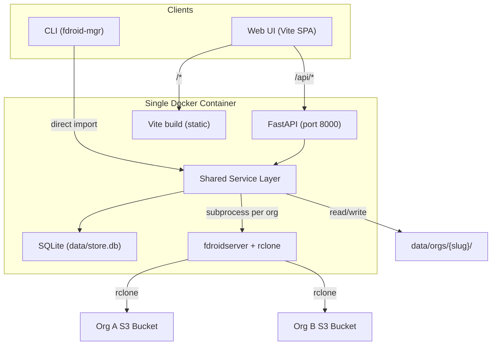

# F-Droid App Distribution Platform

A multi-tenant platform for managing and publishing F-Droid repositories. Think of it as a simplified app store backend: orgs upload signed APKs, edit metadata, and ship to their own repo with one click or one command.

## High-Level Architecture



The key insight: **both the API and CLI share the same Python service layer**. The API is a thin HTTP wrapper, the CLI is a thin terminal wrapper. All business logic lives in services.

## Data Model

### SQLite (`data/store.db`)

Three tables, kept minimal:

- **orgs** -- `id` (UUID), `slug` (unique), `name`, `repo_url`, `repo_name`, `web_base_url`, `s3_endpoint`, `s3_bucket`, `s3_access_key`, `s3_secret_key`, `s3_region`, `signed` (bool), `keystore_password`, `key_alias`, `key_password`, `created_at`, `updated_at`
- **apps** -- `id` (UUID), `org_id` (FK), `package_id`, `apk_filename`, `display_name`, `version_name`, `version_code`, `summary`, `description`, `category`, `license`, `web_url`, `source_url`, `created_at`, `updated_at`
- **deploys** -- `id` (UUID), `org_id` (FK), `type` (build/publish), `status` (pending/running/success/failed), `log` (text), `started_at`, `finished_at`

SQLite is the right fit here -- single file, no external dependency, ships inside the container. The `data/` directory is the only volume mount needed.

### Filesystem (`data/orgs/{slug}/`)

Each org gets an isolated F-Droid workspace:

```
data/
├── store.db
└── orgs/
    ├── my-company/
    │   ├── apks/           # Uploaded APK files
    │   ├── metadata/       # Per-app YAML (fdroid format)
    │   ├── repo/           # fdroid update output (index, icons, APK copies)
    │   ├── tmp/            # fdroid cache
    │   ├── config.yml      # Generated from DB on each build
    │   └── rclone.conf     # Generated from DB on each build
    └── another-org/
        └── ...
```

When a build/publish is triggered, the service:
1. Reads the org's config from SQLite
2. Generates `config.yml` and `rclone.conf` into the org's directory (reusing the template logic from the existing `scripts/init.sh`)
3. Runs `fdroid update` / `fdroid deploy` with `cwd` set to that org's directory
4. Streams output to the `deploys.log` column for live viewing

This means the existing `scripts/` are refactored into a Python service rather than shelled out to bash. The logic is the same (generate config, run fdroid), but it's now callable from code and org-aware.

## Shared Service Layer (`backend/services/`)

This is the core of the system. Both the API and CLI import these directly.

- **`backend/services/database.py`** -- SQLite connection management, schema creation/migration
- **`backend/services/org_service.py`** -- Create, list, get, update, delete orgs. Manages the `data/orgs/{slug}/` directory lifecycle.
- **`backend/services/app_service.py`** -- Upload APK (saves to org's `apks/`, extracts package info via `aapt2`/`apksigner`, creates DB record + metadata YAML). List, get, update metadata, delete.
- **`backend/services/deploy_service.py`** -- Generate fdroid config from DB, run `fdroid update` and `fdroid deploy` as async subprocesses, stream logs, track status in DB.
- **`backend/services/config_gen.py`** -- Generates `config.yml` and `rclone.conf` from an org's DB record (replaces `scripts/init.sh` logic).

## Backend: FastAPI (`backend/`)

- **`backend/main.py`** -- App setup, CORS, static file mount for Vite build, lifespan (DB init)
- **`backend/routers/orgs.py`** -- Org CRUD
- **`backend/routers/apps.py`** -- App CRUD, scoped to org
- **`backend/routers/deploys.py`** -- Trigger build/publish, get status, stream logs (SSE)
- **`backend/requirements.txt`** -- `fastapi`, `uvicorn[standard]`, `python-multipart`, `pyyaml`, `aiosqlite`, `typer[all]`

### API Endpoints

All app/deploy routes are scoped under an org slug:

- **Orgs**: `GET /api/orgs`, `POST /api/orgs`, `GET /api/orgs/:slug`, `PUT /api/orgs/:slug`, `DELETE /api/orgs/:slug`
- **Apps**: `GET /api/orgs/:slug/apps`, `POST /api/orgs/:slug/apps/upload`, `GET /api/orgs/:slug/apps/:packageId`, `PUT /api/orgs/:slug/apps/:packageId`, `DELETE /api/orgs/:slug/apps/:packageId`
- **Deploys**: `POST /api/orgs/:slug/deploy/build`, `POST /api/orgs/:slug/deploy/publish`, `GET /api/orgs/:slug/deploy/status`, `GET /api/orgs/:slug/deploy/logs/:id` (SSE stream)

## CLI: `fdroid-mgr` (`backend/cli.py`)

Built with [Typer](https://typer.tiangolo.com/). Imports the same service layer directly (no HTTP calls). Installed as a script entry point in the Docker image.

```
fdroid-mgr org create --name "My Company" --slug my-company
fdroid-mgr org list
fdroid-mgr org configure my-company --repo-url https://repo.example.com --s3-endpoint ...

fdroid-mgr app upload my-company ./myapp.apk
fdroid-mgr app list my-company
fdroid-mgr app update my-company com.example.app --name "My App" --category Games
fdroid-mgr app remove my-company com.example.app

fdroid-mgr deploy build my-company
fdroid-mgr deploy publish my-company
fdroid-mgr deploy status my-company
```

The CLI is useful for scripting, CI/CD pipelines, and quick local management without opening a browser. Same operations, same data, same outcome.

## Frontend: Vite + React (`frontend/`)

- **Vite + React + TypeScript**
- **Tailwind CSS v4**
- **React Router** with org-scoped routes
- **TanStack Query** for data fetching

### Routing

```
/                           -> Redirect to /orgs or first org dashboard
/orgs                       -> Org list + create
/orgs/:slug                 -> Org dashboard (app count, last deploy, quick actions)
/orgs/:slug/apps            -> App grid with upload drop zone
/orgs/:slug/apps/:packageId -> Metadata editor form
/orgs/:slug/deploy          -> Build/Publish buttons + live log terminal
/orgs/:slug/settings        -> Org config form (repo identity, S3, signing)
```

### Layout

- **Sidebar**: Org switcher (dropdown) at the top, then nav links (Dashboard, Apps, Deploy, Settings)
- **Top bar**: Current org name, minimal branding
- **Content area**: The active page

### Key Components

- **OrgSwitcher** -- Dropdown to switch between orgs, with "Create Org" option
- **AppCard** -- App icon, name, version, package ID. Click to edit, delete action
- **FileUpload** -- Drag-and-drop zone for APK upload with progress
- **LogViewer** -- Terminal-style component that connects to the SSE endpoint for live deploy logs
- **MetadataForm** -- Form for editing app metadata fields with save/reset

## File Structure

```
digitalmarket-fdroid-server/
├── backend/
│   ├── __init__.py
│   ├── main.py                 # FastAPI app
│   ├── cli.py                  # Typer CLI (fdroid-mgr)
│   ├── requirements.txt
│   ├── routers/
│   │   ├── orgs.py
│   │   ├── apps.py
│   │   └── deploys.py
│   └── services/
│       ├── database.py         # SQLite setup + queries
│       ├── org_service.py      # Org CRUD + directory management
│       ├── app_service.py      # APK handling + metadata
│       ├── deploy_service.py   # fdroid subprocess runner
│       └── config_gen.py       # Generate config.yml / rclone.conf
├── frontend/
│   ├── package.json
│   ├── vite.config.ts
│   ├── index.html
│   └── src/
│       ├── main.tsx
│       ├── App.tsx
│       ├── api/                # Typed API client
│       ├── hooks/              # TanStack Query hooks
│       ├── pages/              # Dashboard, Orgs, Apps, AppDetail, Deploy, Settings
│       ├── components/         # OrgSwitcher, AppCard, FileUpload, LogViewer, MetadataForm
│       └── layouts/            # Sidebar layout shell
├── data/                       # Runtime data (Docker volume)
│   ├── store.db
│   └── orgs/
├── scripts/                    # Kept for reference / standalone use
├── Dockerfile                  # Multi-stage: frontend build + runtime
├── docker-compose.yml
├── .env                        # Minimal: just DATA_DIR and PORT
└── .env.example
```

## Docker Deployment

### Multi-stage Dockerfile

1. **Stage 1** (`node:20-slim`): Build frontend -- `npm ci && npm run build`
2. **Stage 2** (Debian Bookworm): Install fdroidserver, rclone, Java 17, Android build-tools, Python deps for FastAPI. Copy `backend/`, copy `frontend/dist/` from stage 1. Entry point: `uvicorn backend.main:app`

### docker-compose.yml

```yaml
services:
  fdroid-manager:
    build: .
    ports:
      - "127.0.0.1:8000:8000"
    volumes:
      - fdroid-data:/srv/fdroid/data
    environment:
      - DATA_DIR=/srv/fdroid/data

volumes:
  fdroid-data:
```

That is the entire deployment. `docker compose up` and visit `localhost:8000`. The `.env` shrinks to almost nothing -- per-org config lives in SQLite, not environment variables.

### Security: Local-Only UI

The web UI and API are **strictly local**. The port binding is `127.0.0.1:8000`, not `0.0.0.0:8000` -- it only listens on localhost and is not reachable from other machines. FastAPI also binds to `127.0.0.1` by default in the container entrypoint.

The **only thing exposed to the internet** is the static F-Droid repo hosted on S3/R2 (via `fdroid deploy`). The management plane stays on your machine. This is why auth is deferred -- there's no attack surface. The CLI works the same way (runs locally, talks directly to the service layer, no network involved).

### Dev mode

```bash
# Terminal 1: Backend
cd backend && uvicorn main:app --reload --port 8000

# Terminal 2: Frontend
cd frontend && npm run dev
```

`vite.config.ts` proxies `/api` to `localhost:8000`.

## Migration from Current Setup

A one-time migration script (`backend/services/migrate.py`) that:

1. Reads the existing `.env` to extract repo config (name, URL, S3 creds)
2. Creates a default org in SQLite with those settings
3. Copies `apks/*.apk` into `data/orgs/{slug}/apks/`
4. Copies `metadata/*.yml` into `data/orgs/{slug}/metadata/`
5. Creates `apps` DB records from the metadata YAML files

Run as: `fdroid-mgr migrate --from-env .env --org-slug my-org`

## What Changes vs. the Current Setup

- **Per-org isolation** replaces the single flat `apks/`+`metadata/` layout
- **SQLite** replaces `.env` as the source of truth for org/app config
- **`config.yml` and `rclone.conf`** are now generated on-the-fly per org before each build (not persisted as top-level files)
- **The existing `scripts/`** are kept but become secondary -- the Python service layer handles the same logic natively
- **Docker entrypoint** changes from one-shot `publish.sh` to long-running `uvicorn`

## Future (not in scope now, but the architecture supports it)

- **Auth**: Add a `users` table + JWT middleware. Org membership via a join table. Token-based CLI auth.
- **Public repo directory**: An optional public-facing page listing all orgs' repos for discovery (the "add your repo to the app store" vision).
- **Webhooks / CI triggers**: POST to `/api/orgs/:slug/deploy/publish` from a CI pipeline with an API token.
- **App icons and screenshots**: Upload and serve from the org's `repo/` directory.
